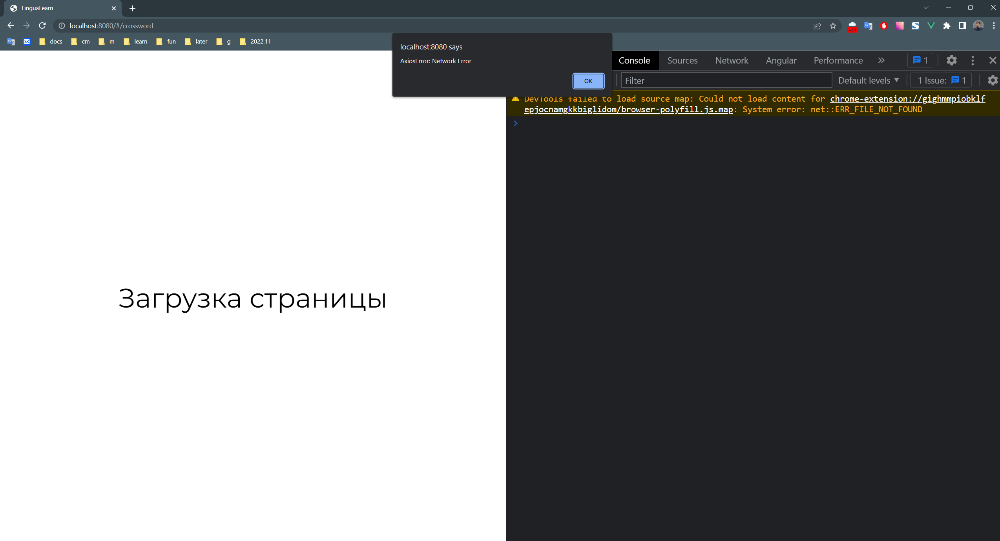
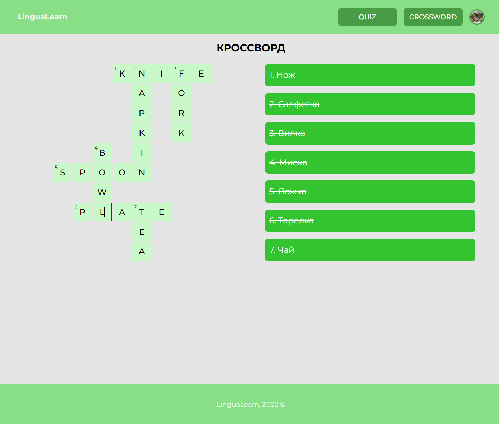

показ алертов в случае если что-то пошло не самый лучший способ.
корректнее не пускать юзера на страницу кроссворда вообще в случае если
кроссворд нельзя загрузить. И справа внизу сделать нотификацию мол не получается загрузить БД
-----

после завершения кроссворда - надо выводить что мол всё правильно, молодец и 
есть смысл сделать второй кроссворд после первого, из-за этого
придётся сейчас подрефакторить логику компонентов, чтобы приложение обновлялось от новых данных
-----
ещё удобнее UX переходить после success слова
автоматически к следующему неотгаданному слову, 
а сейчас курсор остается в старом поле
-----
много лишних комментариев, обычно имена методов и переменных сами себя описывают,
в противном случае их надо переименовывать. Более того, русский язык в исходниках не принят по умолчанию,
комменты пишут на англ, если не оговоренно проектом иное
-----
присмотрись внимательно по коду, у тебя очень часто строки дублируются за небольшим
отличием, обычно все такое выносят в промежуточные функции
-----

